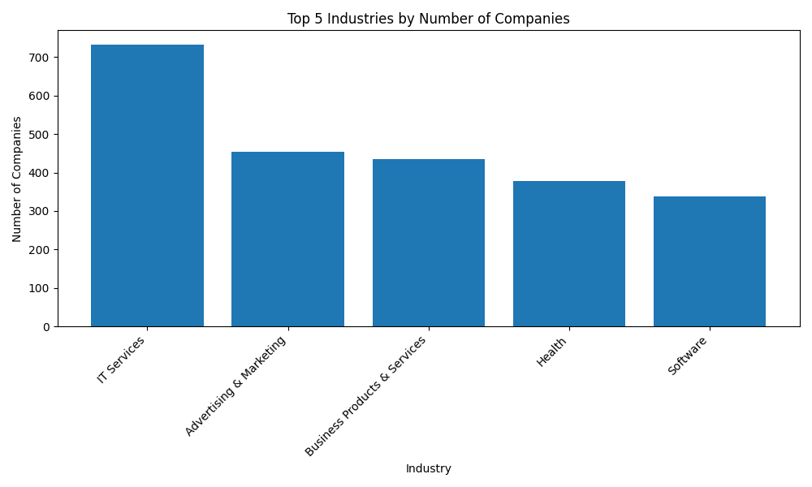
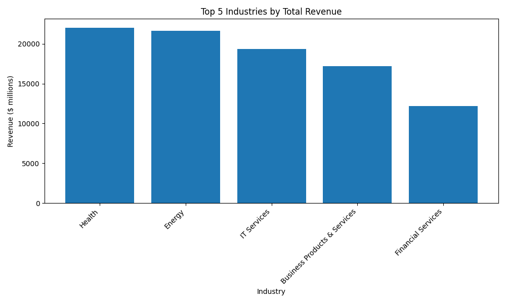
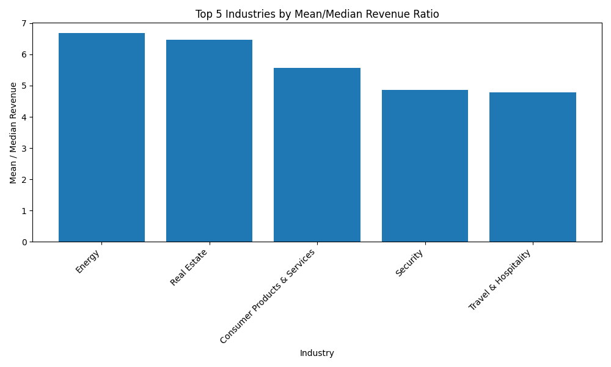

# Inc. 5000 Company Analysis

An exploratory data analysis of the Inc. 5000 company dataset using Python and Pandas.

## Objective

This project explores the Inc. 5000 company dataset to identify patterns in company distribution, revenue, workforce, growth, and geographic concentration.

The analysis compares companies across industries and states and also examines revenue efficiency and concentration within selected industries.

## Dataset

The dataset contains information on 5,000 companies from the Inc. 5000 list, including:

- Company
- Industry
- Revenue
- Growth
- Workers
- State
- City
- Years on the list

The dataset is used for exploratory analysis and the findings should be interpreted as observations from this dataset rather than as a representation of the entire US economy.

## Data Cleaning

Several metadata and web-scraping related columns that were not relevant to the analysis were removed.

The metro column contained 58 missing values. These were investigated against the corresponding state and city values, but no reliable pattern was identified for imputing the missing entries. Since `metro` was not required for the analysis, the missing values were retained.

## Analysis

### Industry Analysis

The industry analysis examines:

- Number of companies
- Percentage of companies
- Total revenue
- Average revenue
- Median revenue
- Total workforce
- Revenue per worker
- Median growth
- Mean-to-median revenue ratio

The mean-to-median revenue ratio is used as an indicator of potential right-skew in industry revenue distributions. A higher ratio suggests that a relatively small number of large companies may be pulling the average revenue above the median.

### Geographic Analysis

The geographic analysis compares states based on:

- Number of companies
- Total revenue
- Total workforce
- Median growth
- Revenue per worker
- Median company revenue

### Revenue Concentration

Revenue concentration was examined for the Energy and Computer Hardware industries as they were the outlier values

Companies within each industry were ranked by revenue, and their individual share and cumulative share of industry revenue were calculated.

## Key Findings

### Industry

- IT Services had the largest number of companies in the dataset.
- Health generated the highest total industry revenue.
- Energy generated high total revenue despite having fewer companies than several other large industries.
- Energy had the highest revenue per worker among the industries analyzed.
- Some industries showed large differences between average and median revenue, indicating potentially skewed revenue distributions.

### Geography

- The leading states differed depending on the metric being examined.
- Rankings based on company count, revenue, workforce, growth, revenue per worker, and median revenue highlighted different aspects of geographic business concentration.

### Revenue Concentration

- Despite having 116 companies, the Energy industry generated approximately 58.7% of its total revenue from its five largest companies.
- Computer Hardware, with only 34 companies, had approximately 49.8% of its total revenue concentrated among its five largest companies.
- These results show that industry-level revenue can be substantially concentrated among a relatively small number of companies in the case of the Energy industry and Computer Hardware was one of the least skewed industry.

### Industry Analysis

#### Top 5 Industries by Number of Companies

#### Top 5 Industries by Total Revenue

#### Top 5 Industries by Mean/Median Revenue Ratio

#### Top 5 States by Number of Companies

#### Top 5 States by Revenue

#### Top 5 States by Workforce

## Tools Used

- Python
- Pandas
- Matplotlib
- Git
- GitHub
